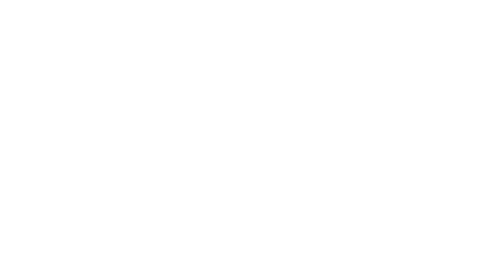
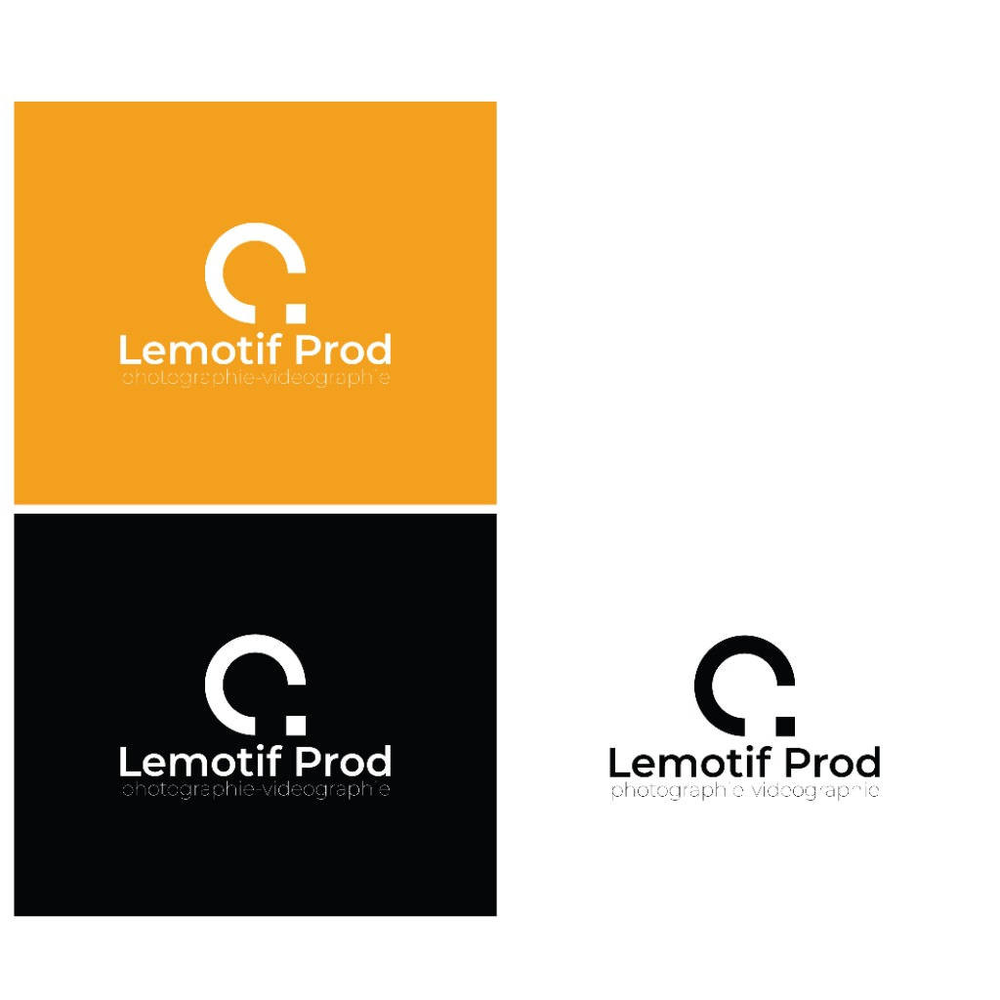

# 📄 Synthèse & Explication du Projet — LEMOTIF PROD

Ce document formalise l'analyse détaillée du cahier des charges (CDC), des réponses au questionnaire client et de l'identité visuelle officielle de l'entreprise **LEMOTIF PROD**.

---

## 1. 🎯 Présentation & Vision de l'Entreprise

- **Nom de l'entreprise :** `LEMOTIF PROD`
- **Baseline / Métiers :** `photographie-videographie`
- **Cœur d'activité :** Captation photo et vidéo événementielle, portraits d'art, reportages d'entreprises, événements privés et retouches professionnelles.
- **Service principal :** **Photographie**
- **Service secondaire :** **Vidéo**
- **Objectifs stratégiques :**
  1. Valoriser la qualité et l'authenticité des réalisations visuelles.
  2. Fournir des descriptions explicatives pour chaque projet du portfolio.
  3. Générer des prises de contact qualifiées et acquérir de nouveaux clients (particuliers & entreprises).

---

## 2. 🎨 Identité Visuelle & Charte Graphique

L'identité repose sur les assets officiels validés et les consignes strictes du questionnaire :

### A. Le Logo Officiel & Déclinaisons

- **Symbole :** Arche circulaire ouverte (évocation d'un objectif photo / diaphragme / lettre stylisée) complétée par un point carré précis en bas à droite.
- **Typographie du logo :** 
  - `Lemotif Prod` : Police sans-serif moderne, nette et contrastée.
  - `photographie-videographie` : Bas de casse ultra-fin avec fort espacement des lettres (*letter-spacing*).
- **Fichiers sources disponibles dans le projet :**
  - Image officielle fond noir : [`assets/logos/logo-lemotifprod-principal.png`](assets/logos/logo-lemotifprod-principal.png)
  - Déclinaisons jaune / noir / blanc : [`assets/logos/logo-lemotifprod-declinaisons.jpg`](assets/logos/logo-lemotifprod-declinaisons.jpg)
  - Vecteur SVG fond noir : [`assets/logos/logo-lemotifprod-vector.svg`](assets/logos/logo-lemotifprod-vector.svg)
  - Vecteur SVG fond jaune : [`assets/logos/logo-lemotifprod-yellow.svg`](assets/logos/logo-lemotifprod-yellow.svg)

### B. Typographie Officielle : Montserrat
- **Police unique du projet :** **Montserrat** (Google Fonts).
- **Hiérarchie & Graisses (*Font Weights*) :**
  - **Logo & Titres principaux (H1/H2) :** `Montserrat Bold (700)` ou `SemiBold (600)` — impact géométrique, net et moderne.
  - **Sous-titres & Badges :** `Montserrat Medium (500)` — lisibilité et distinction sans lourdeur.
  - **Corps de texte & Descriptions de projets :** `Montserrat Regular (400)` ou `Light (300)` — élégance et fluidité de lecture.
  - **Baseline du logo (*photographie-videographie*) :** `Montserrat Extra-Light (200)` en minuscules avec un fort *letter-spacing* (`tracking-[0.25em]`).

### C. Palette de Couleurs & Directives
| Rôle | Couleur | Code Hexa / Rendu | Règle d'usage |
| :--- | :--- | :--- | :--- |
| **Fond dominant** | **Noir profond** | `#000000` / `#08090C` | Dominante sur 100% des pages (ambiance sobre & cinématographique) |
| **Typographie & Titres** | **Blanc pur & Gris clair** | `#FFFFFF` / `#F3F4F6` | Lisibilité maximale, élégance éditoriale |
| **Accents & Bordures** | **Jaune solaire / Safran** | `#EAB308` / `#F59E0B` | **Non dominant** : réservé aux bordures fines des photos et aux touches d'accentuation |

### D. Ambiance & Style
- **Ambiance :** Sombre, créative, sobre et professionnelle.
- **Principe directeur :** *"Pas de designs compliqués, un rendu épuré et direct"* qui laisse toute la place à la puissance des photos et des vidéos.

---

## 3. 👥 Cibles & Segments de Clientèle

Le site s'adresse à 5 profils clients distincts :
1. **Les Particuliers :** Portraits personnels, books d'artistes, séances de couple et de famille.
2. **Les Mariés :** Reportages complets de mariage, cérémonies, préparatifs et souvenirs intemporels.
3. **Les Entreprises (Corporate) :** Portraits de dirigeants/équipes, reportages d'ambiance et valorisation de marque employeur.
4. **Les Restaurants & Commerces :** Photographie culinaire, mise en valeur des espaces, cartes et communication digitale.
5. **Les Artistes & Créateurs :** Visuels pour pochettes, scènes, books promotionnels et réseaux sociaux.

---

## 4. 📐 Structure du Site (Arborescence)

Le site s'articule autour de 5 rubriques clés :

### 1️⃣ Accueil
- En-tête sobre avec le logo officiel `Lemotif Prod`.
- Accroche percutante mettant en valeur la double compétence photo & vidéo.
- Présentation synthétique de l'univers et accès direct aux projets phares.

### 2️⃣ Portfolio (5 Catégories obligatoires)
Organisation avec un système de filtres interactifs fluides :
- 📸 **Portraits** (Studio, lumière naturelle, comédiens, particuliers).
- 💍 **Mariages** (Cérémonies, moments volés, émotion, couples).
- ✨ **Retouches** (Mise en avant du savoir-faire de post-production et précision colorimétrique).
- 🎉 **Événements** (Soirées, galas, événements associatifs ou culturels, restaurants).
- 🏢 **Corporate** (Portraits professionnels, entreprises, savoir-faire).
> ⚠️ **Point spécifique du CDC :** Chaque projet du portfolio doit impérativement comporter sa description contextuelle (contexte de la prise de vue, intention artistique, lieu/matériel).

### 3️⃣ À Propos
- Présentation de la vision de **LEMOTIF PROD**.
- Philosophie de travail : discrétion, capture sur le vif, exigence technique et direction bienveillante.

### 4️⃣ Tarifs & Formules
- Présentation claire et transparente des prestations de base et packs personnalisés.
- Modalités de devis sur-mesure pour les projets complexes (mariages complets, campagnes d'entreprises, captation vidéo multi-caméras).

### 5️⃣ Contact & Réseaux Sociaux
- **Formulaire de contact / réservation :** Simple et rapide (Nom, Email, Téléphone, Type de projet, Date souhaitée, Message).
- **Canaux directs :**
  - Téléphone direct
  - Email professionnel
  - WhatsApp direct
  - Facebook : `lemotifprod`

---

## 5. ⚙️ Exigences Techniques & Standards de Qualité

1. **Mobile-First & Responsive :** Affichage irréprochable sur tous les smartphones, tablettes et écrans Retina.
2. **Zéro "AI Slop" :** Pas de blocs fluorescents ni de surcharge décorative ; priorité absolue aux vraies photos avec bordures jaunes fines.
3. **Vecteurs 100% SVG :** Icônes vectorielles pures pour les réseaux sociaux, le téléphone et la navigation (aucun emoji informel).
4. **Optimisation des Images :** Formats WebP/AVIF pour un temps de chargement instantané.
5. **SEO & Visibilité :** Balisage structuré pour le référencement naturel local (photographe / vidéaste événementiel & corporate).

---

*Document rédigé d'après le cahier des charges officiel et les retours du formulaire Tally de LEMOTIF PROD.*
